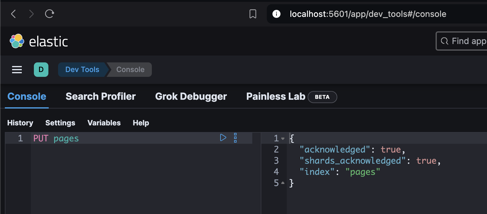
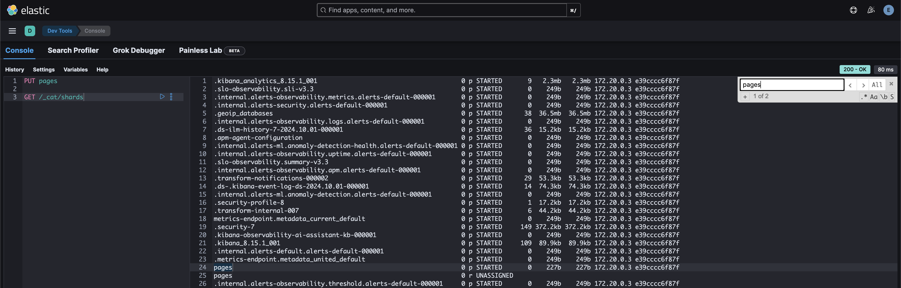

# Elasticsearch

## 0. Setup

```bash
docker compose up -d
```

http://localhost:5601/ を開く

## 1. Introduction

- document
- フィールド: ドキュメントのデータ (RDBのカラムに対応する)

## 2. Getting Started

### 12. Understanding the basic architecture

- node
  - データの一部を保存する論理的なブロック？
  - 同じマシンの上で何個もnodeを立ち上げることができる
- cluster
  - nodeのまとまり
  - cluster同士は一般的には独立している
- document
  - データの単位
  - JSONオブジェクト
  - ESが内部で使用するメタデータと一緒に保存される
  - `_source` に保存される
- index
  - documentの論理的なグループ
  - documentを検索するときに指定する

### 13. Inspecting the cluster

```bash
# API + command の形式
GET /_cluster/health # クラスタのヘルスチェック

GET /_cat/nodes # ノードの確認
GET /_cat/nodes?v # 詳細確認

GET /_cat/indies # indexの確認
GET /_cat/indies?v&expand_wildcards=all # systemのindexの確認
```

- 冒頭の `/` は省略可
- kibanaのコンソールを使うと便利

- curlを使うこともできる
  - JSONを送る場合は明示的に `-H "Content-TYpe:application/json"` を指定する必要がある
  - 送るデータは `"` で囲む

```bash
❯ curl -sX GET -u elastic:password "http://localhost:9200"
{
  "name" : "01dc32983803",
  "cluster_name" : "docker-cluster",
  "cluster_uuid" : "BI60R3QYQteVtU3zuSVYnw",
  "version" : {
    "number" : "8.15.1",
    "build_flavor" : "default",
    "build_type" : "docker",
    "build_hash" : "253e8544a65ad44581194068936f2a5d57c2c051",
    "build_date" : "2024-09-02T22:04:47.310170297Z",
    "build_snapshot" : false,
    "lucene_version" : "9.11.1",
    "minimum_wire_compatibility_version" : "7.17.0",
    "minimum_index_compatibility_version" : "7.0.0"
  },
  "tagline" : "You Know, for Search"
}
```

### 15. Sharding and scalability

- シャーディングはインデックスを小さな要素に分割するための方法
- それぞれのピースを「シャード」と呼ぶ
- シャーディングはインデックスレベルで行われる
- 大きな目的はデータの水平方向のスケール

- 例えば
  - NodeAとNodeBがそれぞれ500GBの容量しかない場合、indexが600GBだとシャードを2つに分けるとか

- シャードはApache Lucene indexと呼ばれる？

---

- The purpose of sharding
  - より多くのドキュメントを保存するため
  - パフォーマンスの向上
    - 並列にクエリを実行できるので、インデックスのスループットを上げることができる

- Configuring the number of shards
  - デフォルトで1つのインデックスは1つのシャードを持つ
  - Split APIでシャードの数を増やせる 
  - Shrink APIでシャードの数を減らせる

- How many shards are optimal?
  - 一概には決められない
  - ノードの数、インデックスのサイズ、インデックスの数、クエリの数などによる

### 16. Understanding replication

- Introduction to replication
  - ノードのハードドライブが壊れたらどうするのか？
  - レプリケーションはデフォルトで有効になっている

- How does replication work?
  - レプリケーションはindexレベルで設定される
  - シャードをレプリケーションする
  - レプリカシャードにはprimaryとそうでないものが存在する
  - primaryとそうでないレプリカシャードはnodeに分散されて置かれる
    - nodeが1つしかない場合、レプリカシャードの置き場所がないためクラスタのステータスがyellowになる

    

    

- Choosing the number of replica shards
  - ユースケースによる

- Snapshots
  - バックアップとしてsnapshotもサポートしている

- Increasing query throughput with replication
  - レプリカシャードは複数のリクエストに同時に答えることができる

## 3. Managing Documents

## 4. Mapping & Analysis
