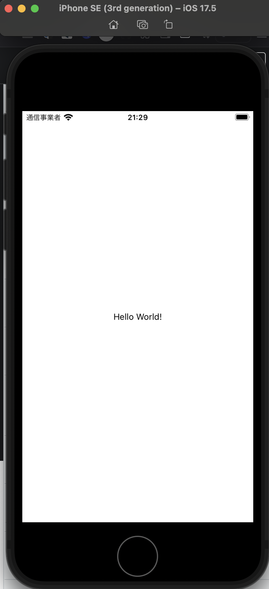

# News App

- [Expo](https://docs.expo.dev/)

## Change npm -> yarn

```bash
❯ yarn
```

## Start developing server

```bash
❯ npx expo start
```



## Tips

- スクロール
  - `ScrollView`
  - `FlatList`
- 定数
  - `npx expo install expo-constants`
- 画面遷移
  - [Moving between screens](https://reactnavigation.org/docs/navigating)
  - [Passing parameters to routes](https://reactnavigation.org/docs/params/)
- 状態管理
  - [Redux](https://redux.js.org/)
